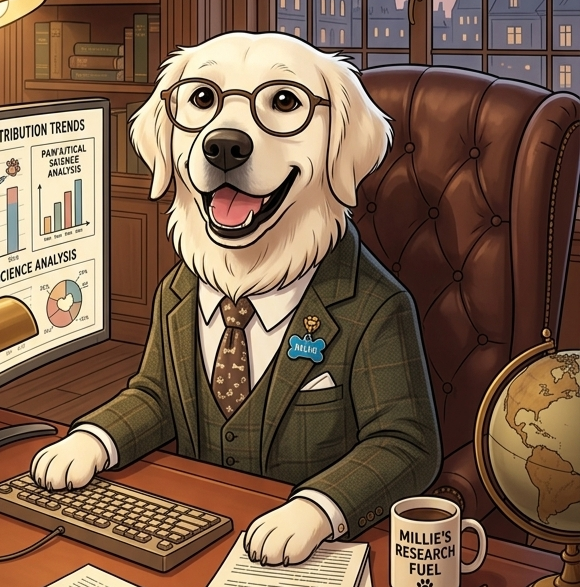

<div style="text-align: center;">
  
</div>

# Deep Dog 1

Multi-agent research system built on LangGraph + LangChain. It turns a prompt into a structured research brief, runs a supervisor + sub-agent loop, and outputs a citation-backed report. Agent is built on top of ThinkDepth Deep Research by Paichun Lin, ans was designed to have greater configurability, reliability and performance, as well as better tool use that allows for research on up to date and developing topics such as current events, stock predictions, etc.

#### At time of publishing, Deep Dog 1 ranked #14 overall and #6 among open-source models on DeepResearchBench.


## About this repo

This project focuses on practical configurability and reproducible research quality:

- **Multi-model architecture**: independent supervisor + sub-agent models so you can mix “reasoning” and “cheap throughput.”
- **Prompt versioning**: swap prompt packs to tune effort/quality without touching logic.
- **Production-minded configuration**: tune timing/effort limits and fallback behavior to control cost and reliability in production use.
- **Open, extensible framework**: designed for others to expand, swap components, and experiment with new agents or prompts.
- **Configurable to allow flexibility to switch from file-based to in-memory output depending on your needs**: switch output modes and consume the returned dict from `run_research()` to wire results directly into your app without relying on files, or run for peronsal local use with file-based output.

## Diffusion process

The agent follows a diffusion-style workflow: it **writes a draft first**, then iteratively refines that draft with real research. This keeps the output structured from the start while still grounding claims in sources.

- **Stage 1: Draft from internal knowledge.** The system writes an initial report based on the research brief only, using `[RESEARCH_NEEDED]` placeholders where real data is required.
- **Stage 2: Research + refine.** The supervisor spawns sub-agents to gather sources, then rewrites the draft using those findings.
- **Example report guidance.** A strong example report is used to anchor the expected depth and rigor. In `ORIGINAL`, it is injected once at the start; in `K1_2`, it is repeatedly compared against the current draft so the supervisor can decide whether more research is needed (higher token usage, slightly better scores).

## Agent Flow

The system uses a **diffusion-based approach**: generate a loose draft from internal knowledge, then iteratively refine it with real research. The architecture is a hierarchical multi-agent system built with LangGraph.

### High-level pipeline

```
User Query
  |
  v
clarify_with_user          (pass-through; clarification logic currently disabled)
  |
  v
write_research_brief       (LLM converts conversation into a detailed research brief)
  |
  v
write_draft_report         (LLM writes an initial draft from internal knowledge only)
  |
  v
supervisor_subgraph        (iterative research + draft refinement loop)
  |
  v
final_report_generation    (synthesizes findings + draft into a citation-backed report)
  |
  v
subtopic_evaluation        (optional; decides if supplementary reports are needed)
  |
  v
subtopic_generation        (optional; generates detailed subtopic reports in parallel)
```

**Files**: `research_agent_scope.py` (scoping nodes), `research_agent_full.py` (full graph wiring).

### Stage 1 -- Scoping

| Node | What it does | Output |
|---|---|---|
| `clarify_with_user` | Placeholder for user clarification (currently skipped). | Routes to `write_research_brief`. |
| `write_research_brief` | Translates raw user messages into a concrete, detailed research brief using structured output. | `research_brief` string stored in state. |
| `write_draft_report` | Generates an initial draft report from the LLM's internal knowledge, guided only by the research brief. No citations -- uses `[RESEARCH_NEEDED]` placeholders where data is missing. | `draft_report` string stored in state, plus `supervisor_messages` seeded with the draft and brief. |

### Stage 2 -- Supervisor research loop

**File**: `multi_agent_supervisor.py`

The supervisor is a looping subgraph that coordinates parallel sub-agents:

```
supervisor  <-->  supervisor_tools
   |                  |
   |     (delegates)  |---> ConductResearch  (deep-dive sub-agent)
   |                  |---> DiscoverOpportunities  (broad exploratory sub-agent)
   |                  |---> refine_draft_report  (rewrites draft with new findings)
   |                  |---> think_tool  (LLM reflection)
   |
   +---> ResearchComplete  (exits loop)
```

**How each iteration works:**

1. The **supervisor** node receives the current draft, research brief, collected findings, and elapsed time. It decides what to research next.
2. The **supervisor_tools** node executes the supervisor's tool calls:
   - `ConductResearch` / `DiscoverOpportunities` spawn sub-agents that run **in parallel** (up to 4 research + 2 discovery agents concurrently).
   - Each sub-agent returns compressed findings which are appended to the shared `notes` list.
   - `refine_draft_report` rewrites the draft report incorporating the new findings.

Core entrypoint: `run_research.py`

## Requirements

- Python 3.11+ recommended
- One LLM provider API key (Gemini/OpenAI/Anthropic/Cerebras/GLM)
- Tavily API key for web search (recommended for normal operation)

> Note: Cerebras support was unstable in local tests; use it only if you're prepared to troubleshoot.

Dependencies are listed in `requirements.txt`.

## 1) Setup

### Option A: `pip` + `requirements.txt` (standard)

```powershell
python -m venv venv
.\venv\Scripts\Activate.ps1
pip install -r requirements.txt
```

### Option B: `uv` (optional)

```powershell
uv venv
.\venv\Scripts\Activate.ps1
uv pip install -r requirements.txt
```

## 2) Configure environment variables

Create a `.env` file at the project root.

`run_research.py` loads this exact file (`./.env`), and `.env` is already gitignored in this repo, so your secrets will not be committed.

### Required keys for current default config

Current `deep_research/config.py` defaults to Gemini fallback models, so you need:

- `GOOGLE_API_KEY` (or `GEMINI_API_KEY`) for model calls
- `TAVILY_API_KEY` for core web-search tool use

Use this template and replace placeholder values with your real keys:

```dotenv
GOOGLE_API_KEY=<YOUR_GOOGLE_OR_GEMINI_API_KEY>
TAVILY_API_KEY=<YOUR_TAVILY_API_KEY>
```

If you prefer the Gemini alias, this also works:

```dotenv
GEMINI_API_KEY=<YOUR_GOOGLE_OR_GEMINI_API_KEY>
TAVILY_API_KEY=<YOUR_TAVILY_API_KEY>
```

### If you change providers in `deep_research/config.py`

Set the provider key that matches your chosen models:

```dotenv
OPENAI_API_KEY=<YOUR_OPENAI_API_KEY>
# or
ANTHROPIC_API_KEY=<YOUR_ANTHROPIC_API_KEY>
# or
CEREBRAS_API_KEY=<YOUR_CEREBRAS_API_KEY>
```

Tooling note: `PERPLEXITY_KEY` is required for Substack/Perplexity-based tool flows. If you want full tool coverage across web + Substack discovery, set both `TAVILY_API_KEY` and `PERPLEXITY_KEY`.

Optional (needed for Substack discovery tools):

```dotenv
PERPLEXITY_KEY=<YOUR_PERPLEXITY_API_KEY>
```

## 3) Run the project

### Prompt as CLI arg

```powershell
python run_research.py --prompt "What are the latest developments in AI safety?"
```

### Prompt from file

```powershell
python run_research.py --prompt-file input.txt
```

### Custom output directory

```powershell
python run_research.py --prompt-file input.txt --output-dir outputs
```

## Output files

By default (`OUTPUT_MODE = "file"` in `deep_research/config.py`), the run writes:

- `research_<timestamp>.md` (main report)
- `research_data_<timestamp>.json` (sources metadata, if collected)
- `trace_<timestamp>.md` (compressed research process trace, when enabled)
- `error_<timestamp>.txt` (only when a run fails)

The trace file (and `trace_content` in in-memory mode) is a compact log of sub-agent actions, tool calls, and key findings for debugging, auditability, or evaluation.

Example integration (in‑memory usage):

```python
import asyncio
from pathlib import Path
from run_research import run_research

result = asyncio.run(run_research(
    prompt="Summarize the latest AI safety research.",
    output_dir=Path("outputs"),
))

final_report = result["final_report"]
sources = result["sources"]
trace = result.get("trace_content")
```

## Config knobs

Main runtime config lives in `deep_research/config.py`:

- `DEFAULT_MODEL` and `MODEL_FALLBACK_CHAIN`
- `SUPERVISOR_MODEL` and `SUPERVISOR_MODEL_FALLBACK_CHAIN`
- `LITE_MODEL` (lightweight tasks like summarization)
- `PROMPT_VERSION` (prompt pack selector)
- `RESEARCH_TIME_MIN_MINUTES` / `RESEARCH_TIME_MAX_MINUTES`
- `RESEARCH_STRICT_TIMEOUT_MINUTES`
- `MAX_RESEARCHER_ITERATIONS` / `SUBAGENT_TIMEOUT_SECONDS`
- `DEFAULT_MAX_TOKENS` (writer model cap)
- `OUTPUT_MODE` (`file`, `db`, `both`)
- `SAVE_REPORT_TO_FILE`
- `ENABLE_SUBTOPIC_GENERATION`
- `ENABLE_RESEARCH_TRACE`
- `LOG_MODE` (`file`, `db`, `both`)

Recommended default for cost efficiency + speed:

- `DEFAULT_MODEL = "gemini-3-flash-preview"`

### Prompt versions

This repo ships multiple prompt packs and a routing layer that selects one by name.

- `PROMPT_VERSION = "K1_2"` (Gives same example article as ORIGINAL but feeds it back alongside current progress to the supervisor agent and asks it to compare the two and decide if the current progress is sufficient or if more research is needed. More token intensive but slightly improved quality)
- `PROMPT_VERSION = "ORIGINAL"` (Gives example article to guide the level of detail expected. Strong results and relatively lower cost than K1_2)
- `PROMPT_VERSION = "FINANCE_V1"` (Uses no example article, more open-ended, slightly less structured to allow for more creative and diverse content. Had good results for stock market research with low cost confugurations. Same token usage as ORIGINAL)

Use this to control effort/quality without touching graph logic.

## Diffusion process

The agent follows a diffusion-style workflow: it **writes a draft first**, then iteratively refines that draft with real research. This keeps the output structured from the start while still grounding claims in sources.

- **Stage 1: Draft from internal knowledge.** The system writes an initial report based on the research brief only, using `[RESEARCH_NEEDED]` placeholders where real data is required.
- **Stage 2: Research + refine.** The supervisor spawns sub-agents to gather sources, then rewrites the draft using those findings.
- **Example report guidance.** A strong example report is used to anchor the expected depth and rigor. In `ORIGINAL`, it is injected once at the start; in `K1_2`, it is repeatedly compared against the current draft so the supervisor can decide whether more research is needed (higher token usage, slightly better scores).

## Troubleshooting

### 1) Import errors for `deep_research`

Run commands from repository root so `run_research.py` can resolve imports correctly.

### 2) LLM auth/provider errors

Check:

- your API key exists in `.env`
- `DEFAULT_MODEL` in `deep_research/config.py` matches the provider key you supplied

### 3) Long stall at draft-generation stage

This repo includes a fix that makes draft generation async + timeout based, and avoids structured output wrapping for long drafts.

## Agent Flow

The system uses a **diffusion-based approach**: generate a loose draft from internal knowledge, then iteratively refine it with real research. The architecture is a hierarchical multi-agent system built with LangGraph.

### High-level pipeline

```
User Query
  |
  v
clarify_with_user          (pass-through; clarification logic currently disabled)
  |
  v
write_research_brief       (LLM converts conversation into a detailed research brief)
  |
  v
write_draft_report         (LLM writes an initial draft from internal knowledge only)
  |
  v
supervisor_subgraph        (iterative research + draft refinement loop)
  |
  v
final_report_generation    (synthesizes findings + draft into a citation-backed report)
  |
  v
subtopic_evaluation        (optional; decides if supplementary reports are needed)
  |
  v
subtopic_generation        (optional; generates detailed subtopic reports in parallel)
```

**Files**: `research_agent_scope.py` (scoping nodes), `research_agent_full.py` (full graph wiring).

### Stage 1 -- Scoping

| Node | What it does | Output |
|---|---|---|
| `clarify_with_user` | Placeholder for user clarification (currently skipped). | Routes to `write_research_brief`. |
| `write_research_brief` | Translates raw user messages into a concrete, detailed research brief using structured output. | `research_brief` string stored in state. |
| `write_draft_report` | Generates an initial draft report from the LLM's internal knowledge, guided only by the research brief. No citations -- uses `[RESEARCH_NEEDED]` placeholders where data is missing. | `draft_report` string stored in state, plus `supervisor_messages` seeded with the draft and brief. |

### Stage 2 -- Supervisor research loop

**File**: `multi_agent_supervisor.py`

The supervisor is a looping subgraph that coordinates parallel sub-agents:

```
supervisor  <-->  supervisor_tools
   |                  |
   |     (delegates)  |---> ConductResearch  (deep-dive sub-agent)
   |                  |---> DiscoverOpportunities  (broad exploratory sub-agent)
   |                  |---> refine_draft_report  (rewrites draft with new findings)
   |                  |---> think_tool  (LLM reflection)
   |
   +---> ResearchComplete  (exits loop)
```

**How each iteration works:**

1. The **supervisor** node receives the current draft, research brief, collected findings, and elapsed time. It decides what to research next.
2. The **supervisor_tools** node executes the supervisor's tool calls:
   - `ConductResearch` / `DiscoverOpportunities` spawn sub-agents that run **in parallel** (up to 4 research + 2 discovery agents concurrently).
   - Each sub-agent returns compressed findings which are appended to the shared `notes` list.
   - `refine_draft_report` rewrites the draft report incorporating the new findings.
3. Control returns to the supervisor for the next iteration, or the loop exits when `ResearchComplete` is called.

**Constraints**: max 15 iterations, hard timeout of 17 minutes, configurable min/max research time.

### Stage 2a -- Sub-agents

**File**: `researcher_agent.py`

Both research and discovery agents share the same graph structure but differ in their tool sets and prompts:

```
llm_call  <-->  tool_node
   |
   v
compress_research  (synthesizes raw findings into a structured summary)
```

**Research agent tools**: `tavily_search`, `think_tool`, `get_reddit_post`, `google_search_grounding`, `get_subreddit_posts`, `search_term_in_subreddit`

**Discovery agent tools**: all research tools plus `search_substack`, `read_substack_article`

Each sub-agent has a 10-minute timeout. Results are compressed into a findings summary with inline citations and a sources list before being returned to the supervisor.

### Stage 3 -- Final report generation

**File**: `research_agent_full.py`

The `final_report_generation` node receives the research brief, all collected findings, and the refined draft report. It produces a comprehensive markdown report with:
- Inline `[1]`, `[2]` citations
- A `CitationPlanList` for ordering sources
- A `## Sources` section at the end

After generation, a **citation validation** step checks that inline citations match the sources list. If validation fails, a single LLM repair pass is attempted. If the repair is rejected (e.g., body length shrank too much), the original report is kept as-is.

### Stage 4 -- Subtopic generation (optional)

Enabled via `ENABLE_SUBTOPIC_GENERATION` in config. The subtopic reports are designed to make agent actions easier to trace and evaluate so you can spot weaknesses and iterate on prompt/tooling improvements.

1. `subtopic_evaluation`: an LLM reviews the final report and research topics to decide whether any sub-topics deserve dedicated deep-dive reports. Uses tool calls (`GenerateSubtopicReport` / `EndSubtopicEvaluation`) to express its decisions.
2. `subtopic_generation`: for each approved subtopic, generates a full report from the collected research notes. All subtopic reports are generated **in parallel**.

### Data flow summary

```
AgentState carries these key fields through the pipeline:

  messages              -- user conversation history
  research_brief        -- structured research question (set in Stage 1)
  draft_report          -- evolving draft (set in Stage 1, refined in Stage 2)
  supervisor_messages   -- supervisor conversation log
  notes                 -- compressed findings from sub-agents (accumulated in Stage 2)
  raw_notes             -- unprocessed sub-agent notes
  final_report          -- citation-backed output (set in Stage 3)
  secondary_reports     -- optional subtopic reports (set in Stage 4)
```

## Acknowledgements

This project builds on **ThinkDepth Deep Research** by Paichun Lin (MIT‑licensed): [https://github.com/thinkdepthai/Deep_Research](https://github.com/thinkdepthai/Deep_Research)

## Benchmarking (separate)

At time of publishing, Deep Dog 1 ranked **#14 overall** and **#6 among open-source models** on DeepResearchBench.

**Official DeepResearchBench score:** **53.5%**

**Model pairing used:**

- Supervisor: `gpt-5.2`
- Subagents: `gemini-3-flash-preview`

If anyone with deeper pockets wants to re-run this with more expensive base models, that would be great 🙂

### Run the benchmark

The benchmark runner executes the 100 task prompts in `data/prompt_data/query.jsonl` and saves per-task JSON files plus an aggregated JSONL submission file.

```powershell
python benchmark_runner.py
```

Useful options:

```powershell
python benchmark_runner.py --test-mode
python benchmark_runner.py --concurrency 2
python benchmark_runner.py --resume
python benchmark_runner.py --output-dir custom_benchmark_outputs
```

**Outputs:**

- `benchmark_outputs/<timestamp>/task_<id>.json`
- `data/test_data/raw_data/<model_name>.jsonl` (aggregated submission file)
